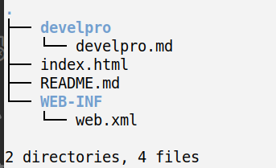

# fileUAD
    file upload and download，用于把服务器搭建成可以网页访问的文件服务器 | 使用jsp + bootstrap 实现

# 01配置环境
>项目搭建在tomcat服务器上，首先是把webapps下原有的应用都删掉了。然后新建了fileUAD目录，也就是这个项目。然后修改了tomcat在conf下的server.xml文件，把端口改为了12345, 默认访问根目录为fileUAD

