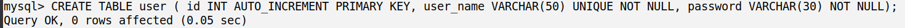
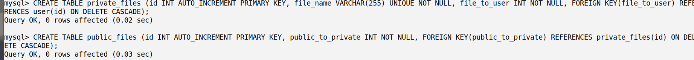

# fileUAD
    file upload and download，用于把服务器搭建成可以网页访问的文件服务器 | 使用jsp + bootstrap 实现

# 01配置环境
>项目搭建在tomcat服务器上，首先是把webapps下原有的应用都删掉了。然后新建了fileUAD目录，也就是这个项目。然后修改了tomcat在conf下的server.xml文件，把端口改为了12345, 默认访问根目录为fileUAD

# 02数据库建立
>数据库用于存储用户，每个用户拥有的文件，以及公共领域的文件。其中文件的存储只是存储了文件的文件名，实际存储是存储在专门的files文件夹。数据库中有三张表，分别为user, private_files, public_files

# 03

